### Bugs Discovered

#### Solved Bugs

1. Navbar link alignment
  * The navbar links would automatically align on the left of the screen next to the logo. 
  * To solve this I applied justify-content: flex-end, allowing the links to hug the right side of the screen
  * Code from [W3Schools.com](https://www.w3schools.com/cssref/css3_pr_justify-content.asp)

2. Footer layout
  * The layout of the footer element would align vertically, even on larger screens.
  * To solve this I put each section (message and social links) into its own div. Then added width:40% and float:left to the message div and width:60% to the social lik div.

3. Footer social link layout
  * The layout of the footer social links aligned vertically,  wasting the provided space.
  * To solve this I added diplay:inline to the css, allowing them to align horizontally.
  * Code from [stackoverflow.com](https://stackoverflow.com/questions/5661520/centering-2-divs-inside-another-vertically)

4. Hero image unresponsive
  * The hero image aligned centrally but was unresponsive, so was partially hidden on smaller screens.
  * To solve this I added max-width: 100%, height auto. this allowed it to resize on smaller screens without stretching and compremising the image quality on larger screens. 
  * Code from [W3Schools.com](https://www.w3schools.com/css/css3_images.asp)

5. Section dividers (hr) invisible
  * After entering section dividers, the space would be present but no line was visible.
  * To solve this I added a border-top: 2px solid yellow, which showed the dividing line while staying in the width perameters I had already set.
  * Code from [W3Schools.com](https://www.w3schools.com/howto/tryit.asp?filename=tryhow_css_style_hr)

6.  Carousel unresponsive
  * The carousel does not centralise or resize for smaller screens.
  * To solve this I added width: 70%, margin-left: 0 auto, margin-right: 0 auto, allowing the carousel to be responsive and centralised.

7. Table columns are uneven
  * The table on the index page are uneven and dependent on the content added to them.
  * To solve this I replace the entire table with two replacements,each with a bootstrap template. One for larger screens and one for smaller screens.
  * Code from [bootstrap.com](https://getbootstrap.com/docs/4.0/layout/grid/), container-large
  * Code from [stackoverflow.com](https://stackoverflow.com/questions/16351404/bootstrap-combining-rows-rowspan), container-small

8. PS/Xbox hero image alignment
  * The hero images of the console pages are not aligned aesthetically.
  * To solve this I seperated the hero image and past images onto seperate levels and made each responsive to the full width of the page. 

#### Remaining Bugs

1. Video link Layout
  * The youtube videos leave a large space underneith before the footer. This is particularly evident on larger screens. 

2. Accordian cards not level
  * The cards in each accordian seem to be aligned by the bottom of the card, rather than the top.

3. Progress bar unresponsive
  * The progress bar does not repond to input from the questionnaire, requires javascript.

### Manual Testing

Expected, testing, result, fix

### Validator Tests

#### index.html
  * W3C HTML Validator - Document checking completed. No errors or warnings to show.
  * Chrome Lighthouse - 99, 95, 93, 90.
  * 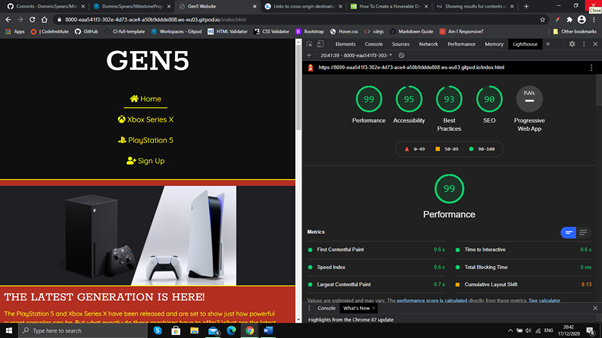

#### xbox.html
  * W3C HTML Validator - Document checking completed. No errors or warnings to show.
  * Chrome Lighthouse - 96, 93, 93, 90. 
  * 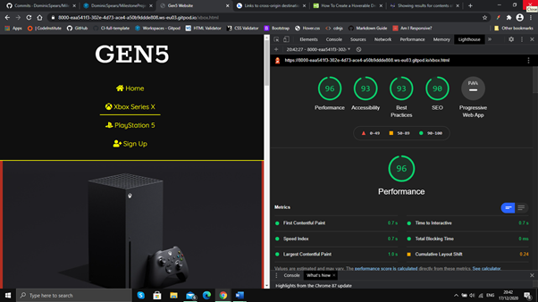

#### ps5.html
  * W3C HTML Validator - Document checking completed. No errors or warnings to show.
  * Chrome Lighthouse - 97, 93, 93, 90. 
  * 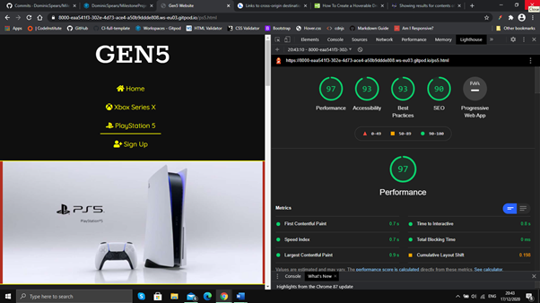

#### sign-up.html
  * W3C HTML Validator - Document checking completed. No errors or warnings to show.
  * Chrome Lighthouse - 99, 97, 93, 100. 
  * 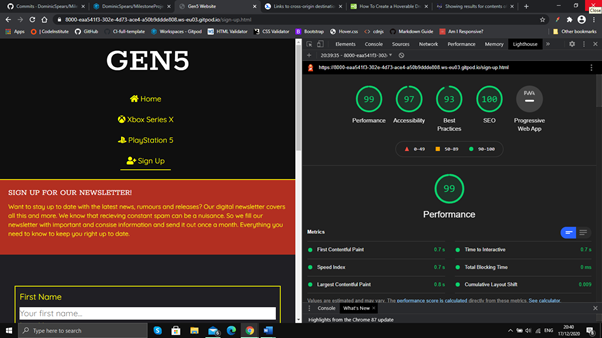

#### complete.html
  * W3C HTML Validator - Document checking completed. No errors or warnings to show.
  * Chrome Lighthouse - 100, 100, 93, 100. 
  * 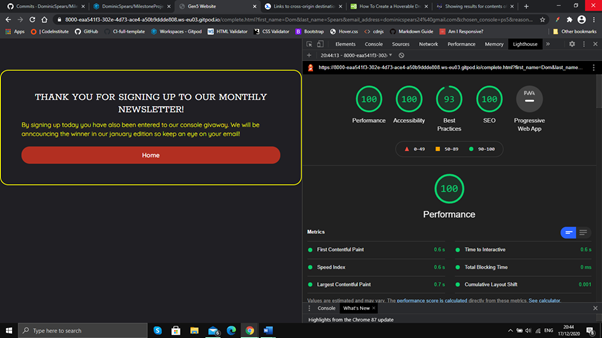

#### style.css
  * W3C CSS Validator - Congratulations! No error found.

### User Story Tests

Story, how issue was addressed, sceenshot

#### Experienced with console gaming:
1. As an experienced gamer, I want to know which console has the best internal specifications e.g. best frame rate, internal storage and reverse compatibility.
  * To address this I created a features table that directly compares the specifications of each console.
  * 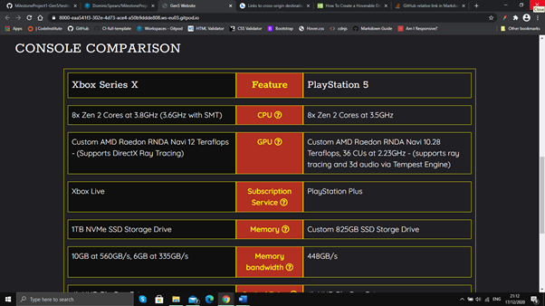

2. As an experienced gamer, I want to sign up for a newsletter so that I am emailed updates about the latest releases and offers.
  * To address this I created a sign up page with a form to take user details, including name and email.
  * 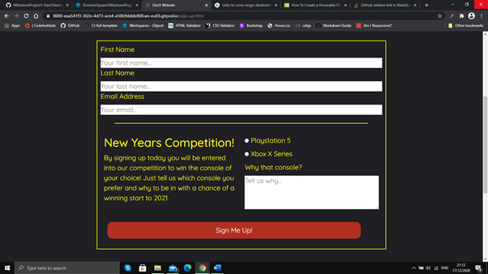

3. As an experienced gamer, I want to know which game franchises are console specific in the new generation.
  * To address this I created a specific section in the games accordion to showcase console specific franchises, on both the xbox and ps page.
  * 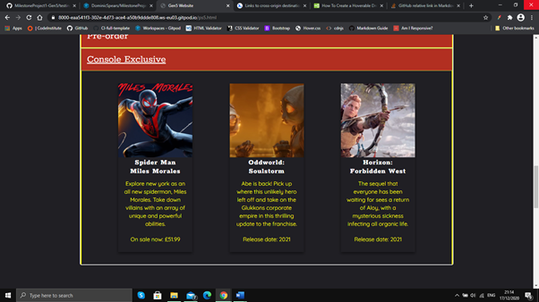

#### New gamer
1. As a new gamer, I want a clear comparison between the two consoles e.g. their price or additional features.
  * To address this I added a price comparison to the console comparison table, as well as some other basic features.
  * 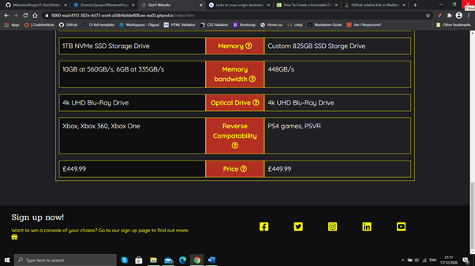

2. As a new gamer, I want each feature to be explained so that I know why it is a pro/con.
  * To address this I added a tooltip to each feature on the comparison table, explaining the feature in simple terms.
  * 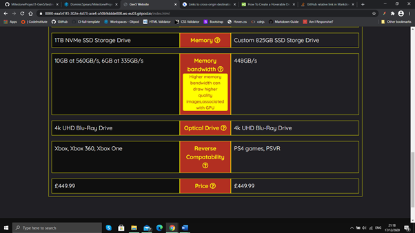

3. As a new gamer, I want to know which games are available on each console right now. 
  * To address this I added a latest releases section to the games accordian, to show the most up to date, available games. I did this for both the xbox and ps pages.
  * 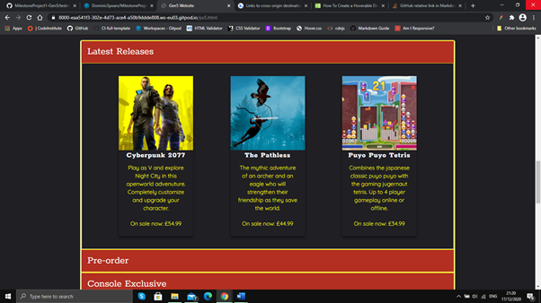

#### Friends/family of new gamer
1. As a friend/family member, I want to know what accessories area available for each console and their prices.
  * To address this I added an accessories carousel to the xbox and ps pages. Each included a price and link to selling website.
  * 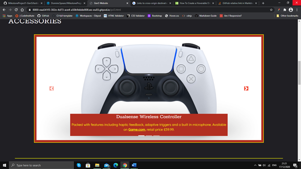

2. As a friend/family member, I want to know about the latest games that are due for pre-order, which would make good presents.
  * To address this I added a pre-order section to the games accordion, to showcase games coming out in the near future.
  * 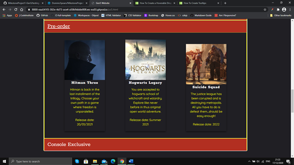
  
3. As a friend/family member, I want to buy my (friend/family member) that latest console but I cannot remember the name of their current model. 
  * To address this I added images of the previous consoles in the series, as they may know an old console by appearence and not by name.
  * 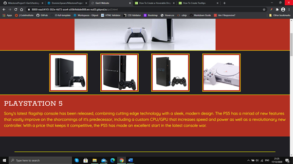